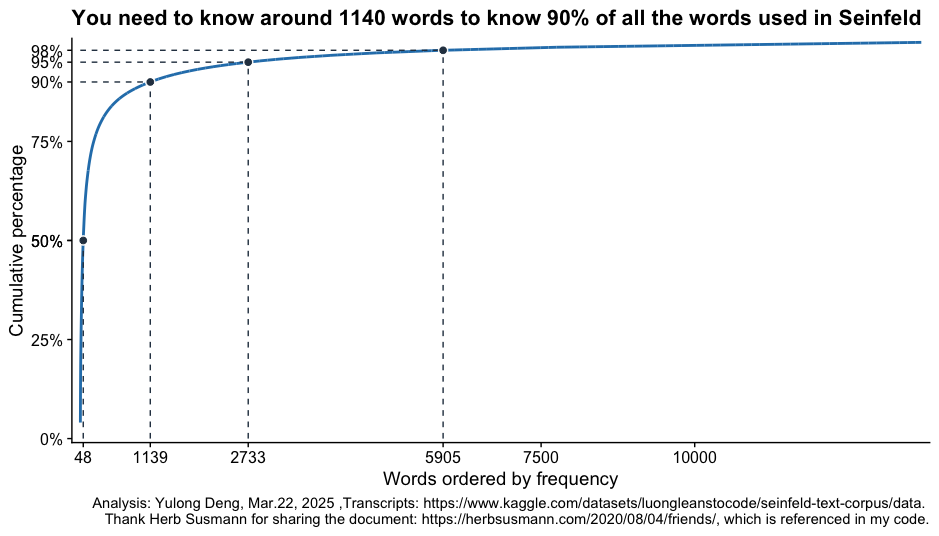

# Data-Analysis-for-Scripts-of-Seinfeld
Make data analysis based on the scripts of American sitcom Seinfeld.

The cumulative percentage of words analysis:

Top 10 words of 1140 words in Seinfeld:

Last 10 words of 1140 words in Seinfeld:

